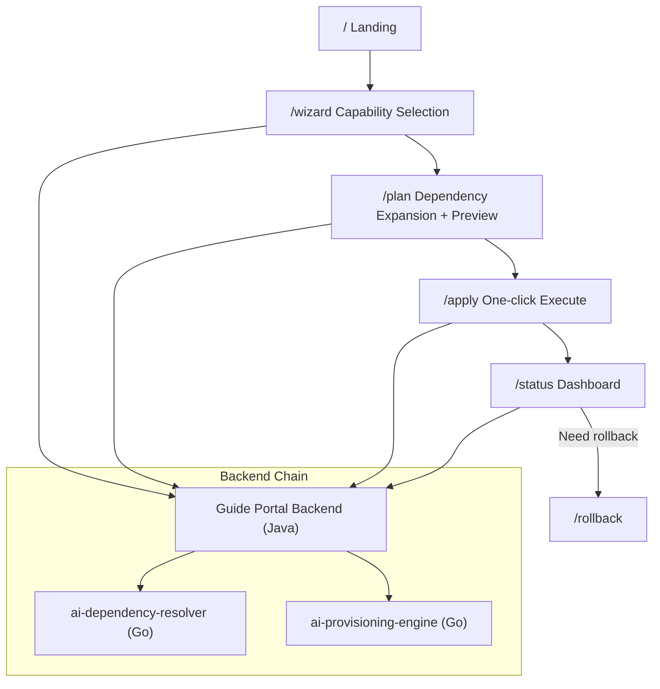
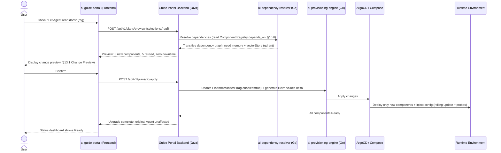
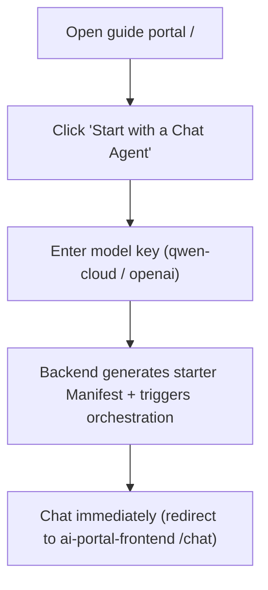
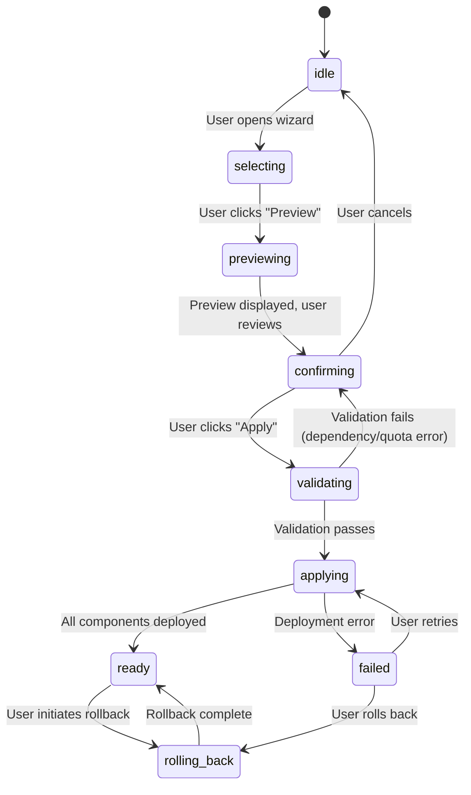
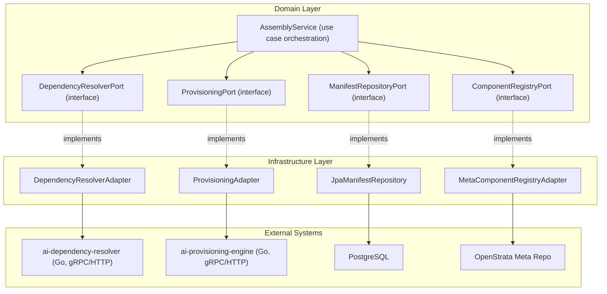

# ai-guide-portal · Architecture (ARCH)

> Assembly domain core repository. Frontend: TypeScript · React 18 + Vite + Ant Design. Backend: Java · Spring Boot 3.x (portal orchestration logic). Maps to architecture document §13 (Guide Portal & Dependency-Aware Auto-Upgrade) and §15.5.1 (Java backend).

## Meta

| Item | Value |
| --- | --- |
| **repo** | `ai-guide-portal` |
| **language / framework** | TypeScript · React 18 + Vite + Ant Design (frontend) / Java · Spring Boot 3.x (backend orchestration) |
| **domain** | assembly (capability assembly / dependency-aware auto-upgrade, §13) |
| **optional** | false (core, installed by default in all profiles) |
| **platform version** | v1.4.0 |
| **doc status** | draft |

---

## 1. Product Positioning & Target Users (Persona)

`ai-guide-portal` is OpenStrata's **sole user assembly entry point** (§13 opening): users "only declare what capability they want", and the portal automatically analyzes dependencies, generates configuration, and drives the platform to **auto-upgrade** to the target form. It is the user interface and execution engine for P10/P11/P12, translating the nine-layer architecture into "business-language checkboxes".

### Personas

| Persona | Role | Core Need | Primary Interaction Area |
| --- | --- | --- | --- |
| **User / Tenant Admin** | Self-service assembler | "I want an Agent that can chat" / "Let Agent read my docs" — check and use, no knowledge of nine layers needed | Capability selection wizard `/wizard`, change preview `/plan`, one-click apply `/apply` |
| **Platform Admin** | Cross-tenant governance | After setting boundaries in Admin Portal, oversee assembly progress / health per tenant | Status dashboard `/status`, rollback `/rollback` |
| **Developer (advanced)** | Wants GitOps/CLI equivalent | Portal experience equivalent to `aictl init/up` (§13.4) | One-click quickstart entry, "5-second start" |

> Assembly boundaries are written by `ai-admin-frontend` + `ai-admin-service` into tenant-level `PlatformManifest` (§14.5 closed loop); the guide portal operates within those boundaries.

### Core Value Proposition

The guide portal abstracts away the nine-layer architecture complexity:

1. **Business language mapping** — users select "Let Agent chat" / "Let Agent read documents" instead of understanding Component Registry, Helm charts, or Kubernetes resources.
2. **Dependency-aware** — selecting a capability automatically resolves transitive dependencies (e.g., selecting "RAG" auto-adds memory + vector store).
3. **One-click apply** — generates PlatformManifest deltas, triggers provisioning engine, and deploys only the diff with zero-downtime rolling updates.

---

## 2. Feature Modules & Routing

Mapping §13.1 portal modules: capability cards / dependency graph engine / change preview / execution orchestration / status dashboard.

### Route Table

| Route | Feature Module | Backend (Java) / Downstream | Arch § |
| --- | --- | --- | --- |
| `/` | **Landing page**: "5-second start" big button "I want a Chat Agent" + profile selection | Java backend → `ai-dependency-resolver` | §13.4 |
| `/wizard` | **Capability selection wizard**: business-language checkbox cards (§13.2 mapping table) | Java backend capabilities catalog | §13.1 / §13.2 |
| `/plan` | **Dependency expansion + change preview**: N new / M reused / zero-downtime preview | Java backend → `ai-dependency-resolver` (dependency graph) | §13.3 |
| `/apply` | **One-click execute**: confirm → write Manifest → trigger orchestration | Java backend → `ai-provisioning-engine` | §13.3 / §13.5 |
| `/status` | **Status dashboard**: per-component deployment / health (real-time feedback) | Java backend → ArgoCD/Compose status | §13.1 |
| `/rollback` | **Rollback & safety**: declarative rollback, pre-check, canary | Java backend → Manifest rewrite + replay | §13.5 |

### Route Guards

- `AuthGuard` (Keycloak) on all routes.
- Tenant-scoped: users can only assemble components within their tenant's whitelist (§14.5).

### Module Interaction Topology



### Capability Categories (Business Language Mapping, §13.2)

| Category | Example Capabilities | Underlying Components |
| --- | --- | --- |
| **Chat & Conversation** | "Let Agent chat", "Multi-turn memory" | `agent-core`, `memory` |
| **Knowledge & Retrieval** | "Let Agent read my docs" (RAG) | `document-loader`, `vector-store (qdrant)`, `embedding` |
| **Tool Use** | "Let Agent search web", "Let Agent call APIs" | `tool-executor`, `api-gateway` |
| **Observability** | "Monitor Agent conversations" | `observability`, `srs-service` |
| **Security** | "Audit Agent actions" | `audit-log`, `rbac` |

---

## 4. Key User Flows (UX Flow)

### 4.1 Core Flow: Select Components → Dependency Expansion → Generate Plan → Execute Upgrade (§13.3 Core Mechanism)



### 4.2 One-Click Quickstart (§13.4 "5-Second Start")



> Equivalent to `aictl init --profile starter --model qwen-cloud && aictl up` (§13.4 Method 1); the portal is Method 2's "5-second start" equivalent.

### 4.3 Auto-Upgrade Three Principles (§13.3)

1. **Dependency Completion**: Selecting A automatically adds its prerequisites (no need to understand dependencies).
2. **Incremental Deployment**: Only deploy/change the diff; running services are not restarted (rolling update + probes).
3. **Zero Code Changes**: Business Agents access capabilities via SPI; new components are auto-discovered on deployment (e.g., after adding Qdrant, the memory system becomes available automatically).

### 4.4 State Machine: Assembly Workflow



### 4.5 Rollback Flow (§13.5)

1. User navigates to `/rollback`, views recent Manifest changes with audit trail.
2. Selects a capability to disable or a Manifest version to restore.
3. Pre-check validates:
   - No other enabled capabilities depend on the target (dependency check).
   - Rollback won't break running Agents (SPI compatibility check).
4. Portal backend rewrites Manifest (sets capability `enabled: false`).
5. Provisions engine replays the Manifest diff, removing only the target components.
6. For high-impact changes (e.g., switching vector store), the system supports dual-write validation before cutover.

---

## A.6 SPI Ports & Adapters (Backend Java Architecture)

The domain layer (`domain/`) defines only port interfaces following Dependency Inversion; the infrastructure layer (`infrastructure/`) provides adapter implementations.

### Domain Ports (Interface Definitions)

```java
// domain/port —— Domain layer ports (no concrete dependency)
package com.openstrata.guide.domain.port;

/**
 * Dependency resolution port: resolve transitive dependency graph
 * for selected capabilities (§13.3)
 */
public interface DependencyResolverPort {
    DependencyGraph resolve(Set<CapabilityId> selections, PlatformManifest current);
}

/**
 * Provisioning / deployment port: convert deployment plan to
 * Helm Values / Compose and trigger ArgoCD (§13.3 / §14.1)
 */
public interface ProvisioningPort {
    DeploymentPlan plan(PlatformManifest manifest, DependencyGraph graph);
    ApplyResult apply(DeploymentPlan plan);
}

/**
 * Manifest persistence port: read/write tenant-level
 * PlatformManifest (§12.1)
 */
public interface ManifestRepositoryPort {
    PlatformManifest load(TenantId tenantId);
    void save(TenantId tenantId, PlatformManifest manifest);
}

/**
 * Component registry port: read metadata repo Component Registry
 * depends_on (§10.6)
 */
public interface ComponentRegistryPort {
    Map<CapabilityId, CapabilityMeta> catalog();   // includes depends_on / default instances
}

/**
 * Authentication port: tenant / role context (§4.7.3)
 */
public interface AuthPort {
    TenantContext currentTenant();
}
```

### Infrastructure Adapters (Anti-Corruption Layer)

```java
// infrastructure/adapter —— Infrastructure layer adapters (ACL)
package com.openstrata.guide.infrastructure.adapter;

/**
 * Calls ai-dependency-resolver (Go) via HTTP/gRPC,
 * converts external response to internal DependencyGraph
 */
@Component
public class DependencyResolverAdapter implements DependencyResolverPort {
    private final DependencyResolverClient client; // Feign / WebClient

    @Override
    public DependencyGraph resolve(Set<CapabilityId> s, PlatformManifest m) {
        var resp = client.resolve(new ResolveRequest(s, m));  // ACL: external DTO → internal domain object
        return DependencyGraph.from(resp);
    }
}

/**
 * Calls ai-provisioning-engine (Go) to generate and apply deltas
 */
@Component
public class ProvisioningAdapter implements ProvisioningPort {
    /* ...ACL conversion... */
}

/**
 * Manifest stored in PostgreSQL (JPA / MyBatis-Flex),
 * tenant_id column for isolation
 */
@Repository
public class JpaManifestRepository implements ManifestRepositoryPort {
    /* ... */
}

/**
 * Reads capability catalog from metadata repo
 * dependencies/external-oss.md at startup (§15.6.2)
 */
@Component
public class MetaComponentRegistryAdapter implements ComponentRegistryPort {
    /* ... */
}
```

### Port-Adapter Design Principles

| Principle | Implementation |
| --- | --- |
| **Dependency Inversion** | Domain layer only depends on port interfaces, not concrete implementations |
| **Anti-Corruption Layer (ACL)** | All external API calls go through adapters; external DTOs never leak into domain |
| **Swappable implementations** (§10.4) | `ProvisioningPort` can switch between ArgoCD adapter / Compose adapter with zero domain changes |
| **Port granularity** | One port per external concern (resolution, provisioning, persistence, registry, auth) |
| **Tenant isolation** | All data access paths have `tenant_id` filtering built into the adapter contract |

### Dependency Flow Diagram



### Service Boundary & Routing

| Port | Adapter | External System | Protocol | Note |
| --- | --- | --- | --- | --- |
| `DependencyResolverPort` | `DependencyResolverAdapter` | `ai-dependency-resolver` | HTTP REST / gRPC | §10.6 depends_on graph |
| `ProvisioningPort` | `ProvisioningAdapter` | `ai-provisioning-engine` | HTTP REST / gRPC | §14.1 plan → apply |
| `ManifestRepositoryPort` | `JpaManifestRepository` | PostgreSQL | JDBC / JPA | §8.2 tenant isolation |
| `ComponentRegistryPort` | `MetaComponentRegistryAdapter` | OpenStrata meta repo | Git / file read | §15.6.2 catalog source |
| `AuthPort` | `KeycloakAuthAdapter` | Keycloak | OpenID Connect | §4.7.3 tenant/role ctx |

### Package Structure (DDD Four-Layer, §15.5.2)

```
com.openstrata.guide/
├── interface_/          # ① Inbound adapters: REST controllers, DTOs
│   └── GuidePortalController.java
├── application/         # ② Application layer: use case orchestration
│   └── AssemblyAppService.java
├── domain/              # ③ Domain layer: entities, value objects, port interfaces
│   ├── model/           #    DependencyGraph, DeploymentPlan, CapabilityId...
│   ├── port/            #    DependencyResolverPort, ProvisioningPort, ...
│   └── service/         #    Domain services (pure logic, no I/O)
└── infrastructure/      # ④ Infrastructure layer: adapter implementations
    ├── adapter/         #    DependencyResolverAdapter, ProvisioningAdapter, ...
    ├── repository/      #    JPA repositories
    └── config/          #    Bean wiring, property config
```

---

## Traceability Matrix

| This Document Section | Architecture Document § |
| --- | --- |
| §1 Product Positioning / Personas | §13 (Guide Portal), §13.4 (Quickstart) |
| §2 Feature Modules / Routing | §13.1 (Portal Modules), §13.2 (Business Language Mapping) |
| §4 Key User Flows | §13.3 (Dependency-Aware Auto-Upgrade), §13.4 (Quickstart), §13.5 (Rollback) |
| A.6 SPI Ports & Adapters | §15.5.2 (Port-Adapter), §10.6 (Component Registry), §12.1 (Manifest) |

---

## Change Log

| Version | Date | Author | Description |
| --- | --- | --- | --- |
| v0.1-draft | 2026-07-17 | OpenStrata Architecture Team | Initial draft from DESIGN.md §1+§2+§4+A.6 backfill |
