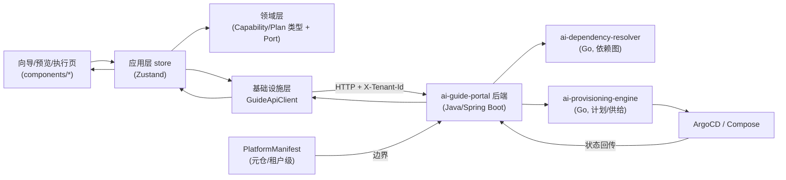
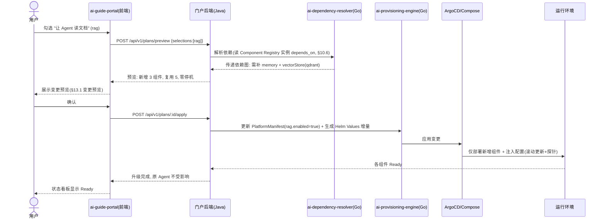
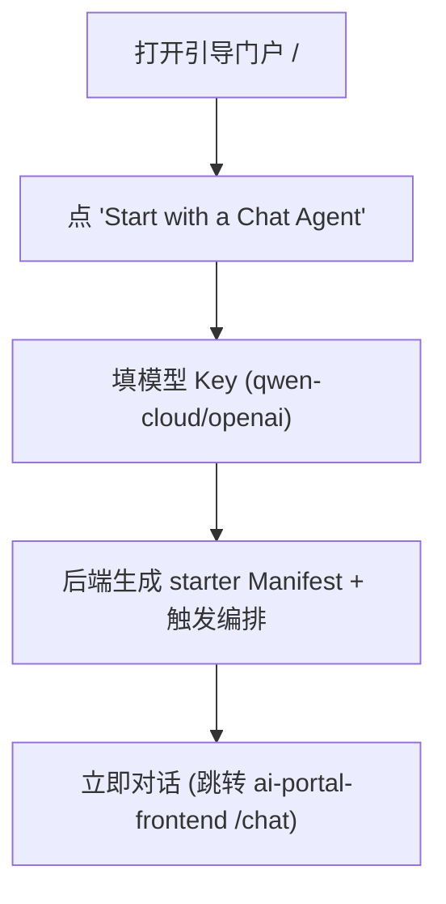

# ai-guide-portal · 详细设计（DESIGN）

> 本文件为 `ai-guide-portal`（引导门户）的详细设计文档，是 OpenStrata 多仓体系中 **assembly** 域核心仓，对应架构文档 **§13 引导门户与依赖感知自动升级**。其特殊之处：主结构为前端（TypeScript），但**门户后端编排逻辑以 Java（Spring Boot 3.x）实现**（§15.6.1），负责依赖展开 / 计划生成 / 供给调用。本文档主体为前端 D 类 11 节；**末尾追加 A 类（Java 服务）的 6/7/8 三节**作为后端片段补充。

## 元信息块

| 项 | 值 |
| --- | --- |
| **repo** | `ai-guide-portal` |
| **语言·框架** | TypeScript · React 18 + Vite + Ant Design（antd，前端）/ **Java · Spring Boot 3.x（门户后端编排）** |
| **领域（domain）** | assembly（能力装配 / 依赖感知自动升级，对应 §13） |
| **optional** | false（core，随所有 profile 默认安装，见 `openstrata-meta/profiles/*.yaml`） |
| **平台版本** | v1.4.0 |
| **文档状态** | 草稿（draft） |
| **负责人** | OpenStrata 架构组 |
| **关联链接** | 本仓 [arch/ARCH.md](./../arch/ARCH.md) · [skills/SKILLS.md](./../skills/SKILLS.md) · [specs/SPECS.md](./../specs/SPECS.md)；架构文档 §13（引导门户）、§12（PlatformManifest）、§10.6（Component Registry）、§15.6（DDD/Java） |

---

## 1. 产品定位与目标用户（Persona）

`ai-guide-portal` 是 OpenStrata **唯一的用户装配入口**（§13 开篇）：用户"只声明想要什么能力"，门户自动分析依赖、生成配置、并驱动平台**自动升级**到目标形态。它是 P10/P11/P12 的用户界面与执行引擎，把九层架构翻译为"业务语言勾选"。

| Persona | 角色 | 核心诉求 | 主要落地区域 |
| --- | --- | --- | --- |
| **用户 / 租户管理员** | 自助装配者 | "我要个能聊天的 Agent""让 Agent 读我的文档"——勾选即用，不懂九层 | 能力选择向导 `/wizard`、变更预览 `/plan`、一键执行 `/apply` |
| **平台管理员** | 跨租户治理 | 在管理 Portal 设定边界后，监督各租户装配进度/健康 | 状态看板 `/status`、回滚 `/rollback` |
| **开发者（进阶）** | 想要 GitOps/CLI 等价物 | 等价于 `aictl init/up`（§13.4）的门户体验 | 一键尝鲜入口、"5 秒起步" |

> 装配边界由 `ai-admin-frontend` + `ai-admin-service` 写入租户级 `PlatformManifest`（§14.5 闭环）；引导门户在该边界内工作。

---

## 2. 功能模块与路由结构（Feature map / routing）

映射 §13.1 门户模块（能力卡片 / 依赖图引擎 / 变更预览 / 执行编排 / 状态看板）。

| 路由 | 功能模块 | 对应后端（Java）/ 下游 | 关联 § |
| --- | --- | --- | --- |
| `/` | 引导首页：5 秒起步大按钮"我要一个能聊天的 Agent" + Profile 选择 | Java 后端 → `ai-dependency-resolver` | §13.4 |
| `/wizard` | **能力选择向导**：业务语言勾选卡片（§13.2 映射表） | Java 后端 capabilities 目录 | §13.1 / §13.2 |
| `/plan` | **依赖展开 + 变更预览**：新增 N / 复用 M / 零停机预览 | Java 后端 → `ai-dependency-resolver`（依赖图） | §13.3 |
| `/apply` | **一键执行**：确认 → 写 Manifest → 触发编排 | Java 后端 → `ai-provisioning-engine` | §13.3 / §13.5 |
| `/status` | **状态看板**：各组件部署/健康（实时回传） | Java 后端 → ArgoCD/Compose 状态 | §13.1 |
| `/rollback` | **回滚与安全**：声明式回滚、预检、灰度 | Java 后端 → Manifest 改写 + 重放 | §13.5 |

> 路由守卫：`AuthGuard`（Keycloak）；租户作用域内只能装配本租户白名单内的组件（§14.5）。

---

## 3. 状态管理与数据流（含与后端会话/租户态）

### 3.1 分层与状态

同 §15.6.3 TS 分层：`features/`（wizard/plan/apply/status）、`application/`（Zustand store）、`domain/`（类型 + Port）、`infrastructure/`（apiClient + Keycloak 适配）。装配态是本门户特有的"向导态"：

```typescript
// application/assembly/AssemblyContext.tsx —— 装配向导态
interface AssemblyState {
  profile: 'starter'|'standard'|'advanced'|'full';   // 来自 profiles/*.yaml
  selections: CapabilityId[];                          // 用户勾选的能力（业务语言）
  dependencyGraph: DependencyNode[];                   // 展开后的传递依赖图（§13.3）
  plan: DeploymentPlan;                                // 新增/复用/下线组件清单
  applyStatus: 'idle'|'validating'|'applying'|'ready'|'failed';
  currentManifest: PlatformManifest;                   // 当前租户 Manifest 快照（§12.1）
  tenant: { id: string; manifest: PlatformManifest };  // 作用域（§8）
}
```

### 3.2 数据流示意



> 依赖倒置：前端领域层只依赖 `GuidePort`（接口），`infrastructure/GuideApiClient` 实现之；后端内部同样按 §15.6.2 端口-适配器（见 A 类 §6）。

---

## 4. 关键用户流程（UX flow）

### 4.1 "选组件 → 依赖展开 → 生成计划 → 执行升级"（§13.3 核心机制）



### 4.2 一键尝鲜（§13.4 "5 秒起步"）



> 等价于 `aictl init --profile starter --model qwen-cloud && aictl up`（§13.4 方式一）；门户是方式二的"5 秒起步"等价物。

### 4.3 自动升级三原则（§13.3）

1. **依赖补全**：选 A 自动补其前置依赖（用户无需懂依赖）。
2. **增量部署**：只部署/变更差异，已运行服务不重启（滚动更新 + 探针）。
3. **零代码改动**：业务 Agent 经 SPI 访问能力，新组件上线即被自动发现（如新增 Qdrant 后记忆系统自动可用）。

---

## 5. 与后端 API 的集成（API client / 鉴权 / 错误态）

### 5.1 后端契约

- 前端统一调用**本仓 Java 后端**（`ai-guide-portal` 后端）REST API（A 类 §7）；后端再编排 `ai-dependency-resolver` / `ai-provisioning-engine`（§13.1 · §14.1）。
- `GuideApiClient`（`infrastructure/`）注入 `X-Tenant-Id` + `Authorization: Bearer`（Keycloak，§4.7.3）。

### 5.2 错误态

| HTTP | 触发 | 前端处理 |
| --- | --- | --- |
| `401` | token 过期 | 静默 refresh → 重试；失败跳登录 |
| `403` | 越租户/选了白名单外组件 | Result 页 + 提示"该能力不在本租户可启用范围" |
| `409` | 依赖校验失败（如开 `rag` 但 `modelProvider` 未开） | 预览页高亮缺失依赖 + "一键补全"按钮（§12.4） |
| `422` | Manifest 增量非法 | 字段级错误 |
| `429` | 装配 API 限流 | 退避重试 |
| `5xx` | 后端/装配引擎故障 | ErrorBoundary + 上报 + 重试 |

### 5.3 装配引擎衔接（职责边界）

- 前端**不直接**调 `ai-dependency-resolver` / `ai-provisioning-engine`；全部经本仓 Java 后端（防腐层，§15.6.2），保证前端与 Go 引擎解耦、可替换（§10）。
- 升级预检（依赖校验 + 资源配额检查，§13.5）在后端 `apply` 前执行，失败阻断并回传原因。

---

## 6. 复用 ai-ui-kit 的组件（组件使用约定）

| 场景 | 复用组件 | 说明 |
| --- | --- | --- |
| 能力卡片（勾选） | `CapabilityCard`（业务语言映射，§13.2） | 由 `ai-ui-kit` 提供卡片 + 选中态 |
| 依赖图可视化 | `MermaidRenderer` | 传递依赖图（§13.3 依赖图引擎） |
| 变更预览差异 | `DiffView` / `DataTable` | 新增/复用/下线组件清单 |
| 执行进度 | `Steps` / `Progress` | 编排各阶段（校验→生成→应用→Ready） |
| 状态看板 | `StatusBadge` + `DataTable` | 各组件部署/健康 |
| 流式日志 | `LogViewer`（虚拟滚动） | 编排日志回传 |
| 确认弹窗 | `ConfirmModal` | 高危执行/回滚二次确认 |

**使用约定**同通用约定：`@openstrata/ui-kit` 引入、只编排不重写、版本钉死 `bom.yaml`；能力卡片文案与 `meta/guide-portal/` 能力目录同源（§15.7.2）。

---

## 7. 多租户 UI（主题 / 租户切换 / 配额展示，映射 §8·§14）

引导门户在"边界内"装配，因此多租户 UI 重点是"可见的边界与配额约束"。

### 7.1 主题与品牌（§8 / §14.2）

- `TenantTheme` 从租户 `PlatformManifest.theme` 注入 antd `ConfigProvider`，与 `ai-portal-frontend` 一致。

### 7.2 租户切换与边界（§14.5 闭环）

- `platform-admin` 可切租户；`tenant-admin` 锁定本租户。
- **关键约束可视化**：向导中"不可选"的能力卡片（不在本租户组件白名单内）灰显并标注"需平台管理员开放"；模型 Key 配置受 `ModelRegistry` 白名单限制（§14.5）。

### 7.3 配额展示与预检（§8.1 / §13.5 / §14.4）

- 执行前展示"本次升级的资源影响"：将新增/变更的组件对 CPU/Token/QPS/向量数配额的影响（从 `ai-admin-service` 取的配额预算）。
- 若超出租户套餐配额，预览阶段即阻断并提示"需提升套餐 or 平台管理员扩容"（§13.5 升级预检 + 资源配额检查）。
- GPU 配额展示同 §8.1·§14.4 注：仅阶段四自托管时才出现。

---

## 8. 构建与部署（Vite / CI-CD）

- **前端**：Vite（TS + React 18），`npm run build` 静态产物；`React.lazy` 路由分割。
- **后端（Java）**：Spring Boot 3.x Maven 打包为可执行 jar，`Dockerfile`（eclipse-temurin 基础镜像）。
- **容器化**：前端 `nginx:alpine`；后端独立镜像；两者通过 `env` 注入（`VITE_GUIDE_API_BASE` / `GUIDE_API_*`，配置外置，§15.6 云原生）。
- **K8s**：`helm/`（前端 deployment + 后端 deployment + 各自 configmap/ingress），无状态、可水平扩容；后端有 PostgreSQL 依赖（A 类 §8）。
- **CI/CD（每仓独立，§15.7.2）**：`.github/` = 前端 `lint→tsc→单测→build→Trivy` + 后端 `mvn test→package→Trivy→推送`；`ai-ui-kit` 钉版本（来自 `bom.yaml`）。
- **与元仓装配**：引导门户/装配引擎按 `repos.yaml` 钉 `ai-guide-portal@v1.4.0`（含前后端）；所有 profile 均含本仓（见 `openstrata-meta/profiles/*.yaml`）。

---

## 9. 可观测性 / 错误监控

- **前端埋点**：`@opentelemetry/web` 采集向导步骤、API 耗时、渲染异常，上报 OTLP（§4.8 core 基线）。
- **错误监控**：全局 `ErrorBoundary` + `window.onerror` → Sentry（脱敏、不含 PII），采样带 `tenant.id`。
- **装配链路追踪**：一次"选→展开→执行"携带 `trace-id`，贯穿前端→Java 后端→Go 引擎→ArgoCD，便于排障（§4.8 Tracing）。
- **审计**：所有 Manifest 变更写入审计日志（即便 `security` 未开，平台自身变更也留痕，§13.5）。

---

## 10. 性能 / 无障碍

- **性能**：向导步骤懒加载；依赖图（Mermaid）仅在有依赖展开时渲染；编排日志虚拟滚动；状态看板轮询改为 SSE/WebSocket 推送（减少轮询开销）。
- **无障碍（a11y）**：antd 原生 a11y；能力卡片键盘可达、`aria-pressed` 表达选中；进度/状态带 `aria-live`；满足 WCAG AA；支持 `prefers-reduced-motion`。
- **国际化**：i18n（中/英），业务语言映射表支持多语（§13.2）。
- **降级**：后端不可达时向导缓存已勾选态，恢复后重试；`ai-ui-kit` 组件失败回退基础渲染。

---

## 11. 开放问题

1. **能力目录来源**：`meta/guide-portal/` 能力目录 vs 后端 `capabilities` 接口，谁是事实源？是否后端启动时从元仓 `dependencies/external-oss.md` 渲染（§15.7.2）。
2. **预览"复用 M 个"的计算口径**：复用判定是"同租户已 enabled 且版本兼容"还是"集群已存在"？需与 `ai-dependency-resolver` 对齐（§13.1）。
3. **回滚 UX 粒度**：声明式回滚（§13.5）是单组件级还是 Manifest 级？前端是否提供"逐组件回滚"选择。
4. **灰度升级展示**：影响面大的切换（如切向量库，§13.5 双写校验）前端如何呈现"双写进行中 → 校验 → 切流"三段态。
5. **Java 后端与 Go 引擎的契约版本**：`ai-dependency-resolver` / `ai-provisioning-engine` 的接口版本如何与 `bom.yaml` `interface_versions` 对齐（§16.1）。

---

## 尾部

### 变更记录

| 版本 | 日期 | 作者 | 说明 |
| --- | --- | --- | --- |
| v0.1-draft | 2026-07-17 | OpenStrata 架构组 | 初稿，覆盖占位骨架；主体 D 类 11 节 + 末尾 A 类 Java 后端 6/7/8 三节 |

### 追溯矩阵（本文档章节 ↔ 架构设计文档 § 编号）

| 本文档 | 架构文档 § |
| --- | --- |
| §1 产品定位 / Persona | §13（引导门户）、§13.4（一键尝鲜） |
| §2 功能模块 / 路由 | §13.1（门户模块）、§13.2（业务语言映射） |
| §3 状态 / 数据流 | §15.6.2（DDD）、§15.6.3（TS 包）、§12.1（Manifest） |
| §4 关键 UX 流程 | §13.3（依赖感知自动升级）、§13.4（尝鲜）、§13.5（回滚） |
| §5 API 集成 / 鉴权 | §15.6.1（Java 后端）、§4.7.3（Keycloak）、§14.1（依赖/供给引擎） |
| §6 复用 ai-ui-kit | §4.1.2（AI UI 组件库）、§15.7.2（guide-portal 内容） |
| §7 多租户 UI | §8（多租户）、§14.2（品牌）、§14.4/§14.5（配额/边界） |
| §8 构建与部署 | §15.6.1（TS+Java 框架）、§15.7.2（每仓 CI）、§12.2（Profile） |
| §9 可观测性 | §4.8（可观测性）、§13.5（审计） |
| §10 性能 / 无障碍 | §4.8（Metrics） |
| §11 开放问题 | — |
| A 类 §6/§7/§8（Java 后端） | §15.6.2（端口-适配器）、§10.6（Component Registry）、§12.1（Manifest）、§13.3（依赖/供给） |

---

# 附录 A：ai-guide-portal 后端（Java · Spring Boot 3.x）设计片段

> 以下为 **A 类（Java 服务）** 的三节补充，描述门户后端编排逻辑。后端遵循 §15.6 统一 DDD 四层 + 端口-适配器；领域层只定义 Port，外部（Go 引擎 / PostgreSQL / Keycloak / 元仓依赖图）经基础设施层 Adapter 接入。

## A.6 SPI 端口与适配器（Port & Adapter）

领域层（`domain/`）只定义端口接口，依赖倒置；基础设施层（`infrastructure/`）提供适配器实现。

```java
// domain/port —— 领域层端口（不依赖具体实现）
package com.openstrata.guide.domain.port;

/** 依赖解析端口：解析所选能力的传递依赖图（§13.3） */
public interface DependencyResolverPort {
    DependencyGraph resolve(Set<CapabilityId> selections, PlatformManifest current);
}

/** 供给/部署端口：把部署计划落地为 Helm Values/Compose 并触发 ArgoCD（§13.3/§14.1） */
public interface ProvisioningPort {
    DeploymentPlan plan(PlatformManifest manifest, DependencyGraph graph);
    ApplyResult apply(DeploymentPlan plan);
}

/** 清单持久化端口：读写租户级 PlatformManifest（§12.1） */
public interface ManifestRepositoryPort {
    PlatformManifest load(TenantId tenantId);
    void save(TenantId tenantId, PlatformManifest manifest);
}

/** 组件注册表端口：读取元仓 Component Registry 的 depends_on（§10.6） */
public interface ComponentRegistryPort {
    Map<CapabilityId, CapabilityMeta> catalog();   // 含 depends_on / 默认实例
}

/** 认证端口：租户/角色上下文（§4.7.3） */
public interface AuthPort {
    TenantContext currentTenant();
}
```

```java
// infrastructure/adapter —— 基础设施层适配器（防腐层 ACL）
package com.openstrata.guide.infrastructure.adapter;

/** 经 HTTP/gRPC 调用 ai-dependency-resolver（Go），把外部响应转内部 DependencyGraph */
@Component
public class DependencyResolverAdapter implements DependencyResolverPort {
    private final DependencyResolverClient client; // Feign/WebClient
    @Override public DependencyGraph resolve(Set<CapabilityId> s, PlatformManifest m) {
        var resp = client.resolve(new ResolveRequest(s, m));   // 防腐：外部 DTO -> 内部领域对象
        return DependencyGraph.from(resp);
    }
}

/** 调用 ai-provisioning-engine（Go）生成并应用增量 */
@Component
public class ProvisioningAdapter implements ProvisioningPort { /* ...ACL 转换... */ }

/** Manifest 存 PostgreSQL（JPA/MyBatis-Flex），tenant_id 列隔离 */
@Repository
public class JpaManifestRepository implements ManifestRepositoryPort { /* ... */ }

/** 启动时从元仓 dependencies/external-oss.md 渲染能力目录（§15.7.2） */
@Component
public class MetaComponentRegistryAdapter implements ComponentRegistryPort { /* ... */ }
```

> 同类多实现可切换（§10.4）：如 `ProvisioningPort` 可切 ArgoCD 适配 / Compose 适配；领域层零改动。所有外部调用经 ACL，外部语义不泄漏进领域（§15.6.2）。

## A.7 对外 API 契约（REST）

门户后端对前端暴露 REST（OpenAPI），对下游 Go 引擎暴露内部契约。核心端点：

| Method | Path | 说明 | 请求/响应要点 |
| --- | --- | --- | --- |
| `GET` | `/api/v1/capabilities` | 能力目录（业务语言卡片，§13.2） | 200 `CapabilityCard[]`（含 `dependsOn`、`enabledByDefault`） |
| `POST` | `/api/v1/plans/preview` | 依赖展开 + 变更预览（§13.3） | body `{selections, profile}` → `{graph, add, reuse, drop, downtime:"none"}` |
| `POST` | `/api/v1/plans/{id}/apply` | 执行升级（写 Manifest + 触发编排，§13.3/§13.5） | 先跑预检（依赖+配额），失败 `409`；成功 `202 + ApplyResult` |
| `GET` | `/api/v1/deployments/status` | 状态看板（§13.1） | `ComponentStatus[]`（pending/ready/failed + 健康） |
| `POST` | `/api/v1/rollbacks` | 声明式回滚（§13.5） | body `{target: {capability, enabled:false}}` → 改写 Manifest 并重放 |

```java
// interface_/GuidePortalController.java —— 接入层（§15.6.2 ①）
@RestController
@RequestMapping("/api/v1")
public class GuidePortalController {
    private final AssemblyAppService appService;   // ② 应用层用例编排

    @PostMapping("/plans/preview")
    public PreviewResponse preview(@RequestBody PreviewRequest req,
                                   @RequestHeader("X-Tenant-Id") String tenantId) {
        return appService.preview(tenantId, req.selections(), req.profile());
    }

    @PostMapping("/plans/{id}/apply")
    public ResponseEntity<ApplyResult> apply(@PathVariable String id,
                                             @RequestHeader("X-Tenant-Id") String tenantId) {
        var result = appService.apply(tenantId, id);   // 内部含预检 + 写 Manifest + 调 ProvisioningPort
        return ResponseEntity.accepted().body(result);
    }
}
```

> API 版本随 `bom.yaml` `interface_versions` 对齐（§16.1）；破坏性变更 bump MAJOR 并附 ADR。

## A.8 数据模型与持久化（Data Model & Persistence）

后端以 PostgreSQL 持久化装配态（§15.6.1）；所有表带 `tenant_id` 列做租户隔离（§8.2 DB 隔离）。采用 JPA + Flyway 迁移。

```sql
-- 租户级 PlatformManifest（§12.1 事实源，按租户一行）
CREATE TABLE platform_manifest (
    tenant_id      VARCHAR(64)  NOT NULL,
    profile        VARCHAR(32)  NOT NULL,         -- starter|standard|advanced|full
    manifest_yaml  TEXT         NOT NULL,         -- openstrata.yaml 全文（spec 段）
    version        BIGINT       NOT NULL,         -- 乐观锁
    updated_at     TIMESTAMPTZ  NOT NULL DEFAULT now(),
    PRIMARY KEY (tenant_id)
);

-- 能力选择（向导态快照，支撑预览/回滚）
CREATE TABLE capability_selection (
    id             BIGSERIAL PRIMARY KEY,
    tenant_id      VARCHAR(64)  NOT NULL,
    capability     VARCHAR(64)  NOT NULL,
    enabled        BOOLEAN      NOT NULL,
    created_at     TIMESTAMPTZ  NOT NULL DEFAULT now()
);
CREATE INDEX idx_cap_sel_tenant ON capability_selection(tenant_id);

-- 部署计划（依赖展开产物，§13.3）
CREATE TABLE deployment_plan (
    id             VARCHAR(36)  PRIMARY KEY,       -- UUID
    tenant_id      VARCHAR(64)  NOT NULL,
    graph_json     JSONB        NOT NULL,         -- 传递依赖图
    add_count      INT          NOT NULL,
    reuse_count    INT          NOT NULL,
    drop_count     INT          NOT NULL,
    status         VARCHAR(16)  NOT NULL,         -- validating|applying|ready|failed
    created_at     TIMESTAMPTZ  NOT NULL DEFAULT now()
);

-- 审计（§13.5 / §14.6：Manifest 变更留痕）
CREATE TABLE manifest_audit (
    id             BIGSERIAL PRIMARY KEY,
    tenant_id      VARCHAR(64)  NOT NULL,
    actor          VARCHAR(64)  NOT NULL,
    op             VARCHAR(32)  NOT NULL,         -- create|enable|disable|rollback
    capability     VARCHAR(64),
    before_yaml    TEXT,
    after_yaml     TEXT,
    created_at     TIMESTAMPTZ  NOT NULL DEFAULT now()
);
```

> 持久化约束：写 Manifest 前在应用层跑依赖校验（§12.4 表：如 `rag` 须已开 `modelProvider`/`memory`/`vectorStore`）+ 资源配额检查（§13.5）；`manifest_audit` 不可变追加（即便 `security` 未开也留痕）。所有查询带 `tenant_id` 谓词，复用 PostgreSQL Schema/Rown-Level Security 隔离（§8.2）。
