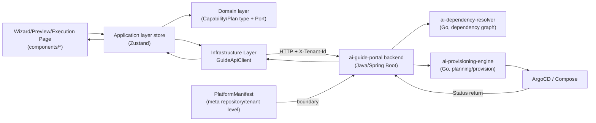
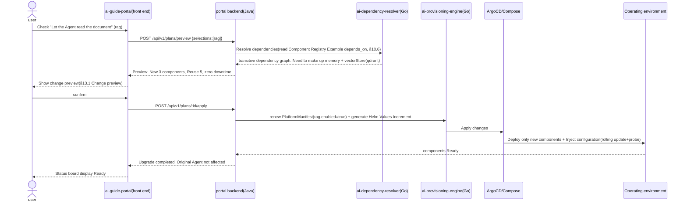
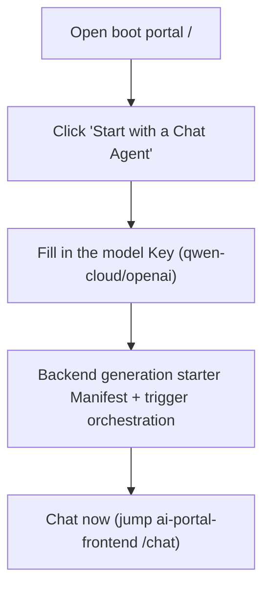

# ai-guide-portal · DESIGN

> This document is the detailed design document of `ai-guide-portal` (guide portal), which is the core repository of the **assembly** domain in the OpenStrata multi-repository system and corresponds to the architecture document **§13 Guide Portal and Dependency-Aware Automatic Upgrade**. Its special feature: the main structure is the front-end (TypeScript), but the portal back-end orchestration logic is implemented in Java (Spring Boot 3.x) (§15.5.1), which is responsible for dependency expansion/plan generation/supply calls. The main body of this document is section 11 of the front-end class D; **three sections 6/7/8 of class A (Java service) are appended at the end as a supplement to the back-end fragments.

## Meta information block

| item | value |
| --- | --- |
| **repo** | `ai-guide-portal` |
| **Language · Framework** | TypeScript · React 18 + Vite + Ant Design (antd, front-end) / **Java · Spring Boot 3.x (portal back-end orchestration) ** |
| **domain** | assembly (capability assembly/dependency-aware automatic upgrade, corresponding to §13) |
| **optional** | false (core, installed by default with all profiles, see `openstrata-meta/profiles/*.yaml`) |
| **Platform version** | v1.0.0 |
| **Document Status** | Draft (draft) |
| **Responsible Person** | OpenStrata Architecture Group |
| **Affiliated links** | This repository [docs/ARCH.md](./ARCH.md) · [docs/SKILLS.md](./SKILLS.md) · [docs/SPECS.md](./SPECS.md); Architecture document §13 (Bootstrap Portal), §12 (PlatformManifest), §10.6 (Component Registry), §15.5 (DDD/Java) |

---

## 1. Product positioning and target users (Persona)

`ai-guide-portal` is OpenStrata's **only user assembly portal** (beginning of §13): users "only declare what capabilities they want", and the portal automatically analyzes dependencies, generates configurations, and drives the platform to **automatically upgrade** to the target form. It is the user interface and execution engine of P10/P11/P12, translating the nine-layer architecture into "business language ticking".

| Persona | Role | Core demands | Main target areas |
| --- | --- | --- | --- |
| **User/Tenant Administrator** | Self-service installer | "I want an Agent that can chat" "Let the Agent read my documents" - check and use, do not understand the nine layers | Capability selection wizard `/wizard`, change preview `/plan`, one-click execution `/apply` |
| **Platform Administrator** | Cross-tenant management | After setting boundaries in the management portal, monitor the installation progress/health of each tenant | Status dashboard `/status`, rollback `/rollback` |
| **Developer (Advanced)** | Want GitOps/CLI equivalent | Portal experience equivalent to `aictl init/up` (§13.4) | One-click early adopter entry, "start in 5 seconds" |

> The assembly boundary is written to the tenant-level `PlatformManifest` by `ai-admin-frontend` + `ai-admin-service` (§14.5 Closed Loop); the bootstrap portal works within this boundary.

---

## 2. Function module and routing structure (Feature map/routing)

Mapping §13.1 Portal module (Capability Card/Dependency Graph Engine/Change Preview/Execution Orchestration/Status Kanban).

| Routing | Function module | Corresponding backend (Java) / downstream | Association § |
| --- | --- | --- | --- |
| `/` | Boot home page: 5 seconds big start button "I want an Agent that can chat" + Profile selection | Java backend → `ai-dependency-resolver` | §13.4 |
| `/wizard` | **Capability Selection Wizard**: Business Language Check Card (§13.2 Mapping Table) | Java Backend Capabilities Directory | §13.1 / §13.2 |
| `/plan` | **Dependency expansion + change preview**: New N / Reuse M / Zero-downtime preview | Java backend → `ai-dependency-resolver` (dependency graph) | §13.3 |
| `/apply` | **One-click execution**: Confirm → Write Manifest → Trigger orchestration | Java backend → `ai-provisioning-engine` | §13.3 / §13.5 |
| `/status` | **Status Board**: Deployment/health of each component (real-time postback) | Java backend → ArgoCD/Compose status | §13.1 |
| `/rollback` | **Rollback and Security**: Declarative Rollback, Preflight, canary | Java Backend → Manifest Rewrite + Replay | §13.5 |

> Routing guard: `AuthGuard` (Keycloak); only components in the tenant's whitelist can be installed in the tenant scope (§14.5).

---

## 3. State management and data flow (including back-end session/tenant state)

### 3.1 Layering and status

Same as §15.5.3 TS layer: `features/` (wizard/plan/apply/status), `application/` (Zustand store), `domain/` (type + Port), `infrastructure/` (apiClient + Keycloak adaptation). The assembly state is the unique "wizard state" of this portal:

```typescript
//application/assembly/AssemblyContext.tsx —— Assembly wizard state
interface AssemblyState {
  profile: 'starter'|'standard'|'advanced'|'full';   //From profiles/*.yaml
  selections: CapabilityId[];                          //The ability of users to check (business language)
  dependencyGraph: DependencyNode[];                   //Expanded transitive dependency graph (§13.3)
  plan: DeploymentPlan;                                //List of new/reused/offline components
  applyStatus: 'idle'|'validating'|'applying'|'ready'|'failed';
  currentManifest: PlatformManifest;                   //Current tenant manifest snapshot (§12.1)
  tenant: { id: string; manifest: PlatformManifest };  //Scope (§8)
}
```

### 3.2 Data flow diagram



> Dependency inversion: The front-end domain layer only relies on `GuidePort` (interface), which is implemented by `infrastructure/GuideApiClient`; the back-end internally also follows §15.5.2 port-adapter (see Class A §6).

---

## 4. Key user flow (UX flow)

### 4.1 "Select components → Dependency expansion → Generate plan → Perform upgrade" (§13.3 Core Mechanism)



### 4.2 Try something new with one click (§13.4 "Start in 5 seconds")



> Equivalent to `aictl init --profile starter --model qwen-cloud && aictl up` (§13.4 Method 1); the portal is the "5-second start" equivalent of Method 2.

### 4.3 Three principles of automatic upgrade (§13.3)

1. **Dependency completion**: Select A to automatically complete its pre-dependencies (users do not need to understand dependencies).
2. **Incremental deployment**: only deploy/change differences, running services will not be restarted (rolling update + probe).
3. **Zero code changes**: The business agent has SPI access capabilities, and new components are automatically discovered as soon as they go online (for example, the memory system is automatically available after adding Qdrant).

---

## 5. Integration with back-end API (API client / authentication / error status)

### 5.1 Backend Contract

- The front end uniformly calls **this repository Java backend** (`ai-guide-portal` backend) REST API (Class A §7); the backend then orchestrates `ai-dependency-resolver` / `ai-provisioning-engine` (§13.1 · §14.1).
- `GuideApiClient` (`infrastructure/`) injects `X-Tenant-Id` + `Authorization: Bearer` (Keycloak, §4.7.3).

### 5.2 Error status

| HTTP | Trigger | Front-end processing |
| --- | --- | --- |
| `401` | token expired | silent refresh → retry; fail to log in |
| `403` | Over-tenant/selected components outside the whitelist | Result page + prompt "This capability is not within the enablement scope of this tenant" |
| `409` | Dependency verification failed (for example, `rag` is turned on but `modelProvider` is not turned on) | Preview page highlights missing dependencies + "One-click completion" button (§12.4) |
| `422` | Illegal Manifest increment | Field-level error |
| `429` | Assembly API current limit | Backoff retry |
| `5xx` | Backend/assembly engine failure | ErrorBoundary + report + retry |

### 5.3 Assembly engine connection (responsibility boundaries)

- The front-end does not directly adjust `ai-dependency-resolver` / `ai-provisioning-engine`; all go through the Java backend of this repository (anti-corrosion layer, §15.5.2) to ensure that the front-end and Go engine are decoupled and replaceable (§10).
- Upgrade pre-check (dependency verification + resource quota check, §13.5) is executed before backend `apply`, and failure is blocked and the reason is returned.

---

## 6. Reuse components of ai-ui-kit (component usage convention)

| Scenario | Reuse components | Description |
| --- | --- | --- |
| Capability Card (checked) | `CapabilityCard` (Business Language Mapping, §13.2) | Card provided by `ai-ui-kit` + checked |
| Dependency graph visualization | `MermaidRenderer` | Transitive dependency graph (§13.3 Dependency graph engine) |
| Change preview difference | `DiffView` / `DataTable` | List of new/reused/offline components |
| Execution progress | `Steps` / `Progress` | Orchestrate each stage (verification → generation → application → Ready) |
| Status dashboard | `StatusBadge` + `DataTable` | Deployment/health of each component |
| Streaming log | `LogViewer` (virtual scrolling) | Orchestrated log postback |
| Confirmation pop-up window | `ConfirmModal` | High-risk execution/rollback secondary confirmation |

**Usage convention** is the same as the general convention: `@openstrata/ui-kit` is introduced, only edited without rewriting, and the version is nailed to `bom.yaml`; the capability card copy has the same origin as the `meta/guide-portal/` capability directory (§15.6.2).

---

## 7. Multi-tenant UI (theme/tenant switching/quota display, mapping §8·§14)

The bootstrap portal is assembled "within boundaries", so the multitenant UI focuses on "visible boundaries with quota constraints".

### 7.1 Theme and Brand (§8 / §14.2)

- `TenantTheme` injects antd `ConfigProvider` from tenant `PlatformManifest.theme`, consistent with `ai-portal-frontend`.

### 7.2 Tenant switching and boundaries (§14.5 Closed loop)

- `platform-admin` can switch tenants; `tenant-admin` can lock this tenant.
- **Visualization of key constraints**: "Unselectable" capability cards in the wizard (not in the whitelist of this tenant's components) are grayed out and marked "Requires openness by platform administrator"; model Key configuration is restricted by the `ModelRegistry` whitelist (§14.5).

### 7.3 Quota display and pre-check (§8.1 / §13.5 / §14.4)

- Display the "resource impact of this upgrade" before execution: the impact of the new/changed components on the CPU/Token/QPS/vector quota (quota budget taken from `ai-admin-service`).
- If the tenant package quota is exceeded, the preview phase will be blocked and a message "Need to upgrade the package or expand the platform administrator's capacity" will be prompted (§13.5 Upgrade pre-check + resource quota check).
- GPU quota display is the same as §8.1·§14.4 Note: Appears only when stage four is self-hosted.

---

## 8. Build and deploy (Vite/CI-CD)

- **Front end**: Vite (TS + React 18), `npm run build` static product; `React.lazy` routing split.
- **Backend (Java)**: Spring Boot 3.x Maven is packaged as an executable jar, `Dockerfile` (eclipse-temurin base image).
- **Containerization**: front-end `nginx:alpine`; back-end independent image; both injected through `env` (`VITE_GUIDE_API_BASE` / `GUIDE_API_*`, external configuration, §15.5 cloud native).
- **K8s**: `helm/` (front-end deployment + back-end deployment + respective configmap/ingress), stateless, horizontally scalable; the back-end has PostgreSQL dependency (Class A §8).
- **CI/CD (each repository is independent, §15.6.2)**: `.github/` = front-end `lint→tsc→single test→build→Trivy` + back-end `mvn test→package→Trivy→push`; `ai-ui-kit` nailed version (from `bom.yaml`).
- **Assembled with meta repository**: The guide portal/assembly engine is nailed to `ai-guide-portal@v1.0.0` according to `repos.yaml` (including front and back ends); all profiles include this repository (see `openstrata-meta/profiles/*.yaml`).

---

## 9. Observability / Error Monitoring

- **Front-end instrumentation**: `@opentelemetry/web` Collection wizard steps, API time consumption, rendering exceptions, reported to OTLP (§4.8 core baseline).
- **Error monitoring**: global `ErrorBoundary` + `window.onerror` → Sentry (desensitized, without PII), sampling with `tenant.id`.
- **Assembly link tracing**: One "select→expand→execute" carries `trace-id`, which runs through front-end→Java back-end→Go engine→ArgoCD for easy troubleshooting (§4.8 Tracing).
- **Audit**: All Manifest changes are written to the audit log (even if `security` is not turned on, the platform's own changes will leave traces, §13.5).

---

## 10. Performance/Accessibility

- **Performance**: Wizard steps are lazy loaded; dependency graph (Mermaid) is only rendered when dependencies are expanded; virtual scrolling of orchestration logs; status board polling is changed to SSE/WebSocket push (reduces polling overhead).
- **Accessibility (a11y)**: antd native a11y; ability card keyboard reachable, `aria-pressed` expression selected; progress/status with `aria-live`; meets WCAG AA; supports `prefers-reduced-motion`.
- **Internationalization**: i18n (Chinese/English), the business language mapping table supports multiple languages ​​(§13.2).
- **Downgrade**: When the backend is unreachable, the wizard cache is checked. Try again after recovery; if the `ai-ui-kit` component fails, it will fall back to basic rendering.

---

## 11. Open questions

1. **Capability catalog source**: `meta/guide-portal/` Capability catalog vs back-end `capabilities` interface, who is the source of truth? Whether to render from the meta repository `dependencies/external-oss.md` when the backend is started (§15.6.2).
2. **Preview the calculation caliber of "reusing M": Is the reuse judgment "the same tenant is enabled and the version is compatible" or "the cluster already exists"? Requires alignment with `ai-dependency-resolver` (§13.1).
3. **Rollback UX granularity**: Is declarative rollback (§13.5) at the single-component level or at the manifest level? Whether the frontend offers a "per-component rollback" option.
4. **Canary upgrade display**: How does the front-end display the three-stage state of "double writing in progress → verification → flow cutover" for a switch with a large impact (such as switching the vector library, §13.5 double writing verification).
5. **Contract versions between Java backend and Go engine**: How the interface versions of `ai-dependency-resolver` / `ai-provisioning-engine` are aligned with `bom.yaml` `interface_versions` (§16.1).

---

## Tail

### Change Record

| Version | Date | Author | Description |
| --- | --- | --- | --- |
| v0.1-draft | 2026-07-17 | OpenStrata Architecture Group | First draft, covering the placeholder skeleton; main class D 11 sections + end class A Java backend 6/7/8 three sections |

### Traceability Matrix (Chapter of this document ↔ Architecture Design Document § Number)

| This document | Architecture documentation § |
| --- | --- |
| §1 Product Positioning / Persona | §13 (Guidance Portal), §13.4 (One-click early adopter) |
| §2 Function Module/Routing | §13.1 (Portal Module), §13.2 (Business Language Mapping) |
| §3 Status/Data Flow | §15.5.2 (DDD), §15.5.3 (TS package), §12.1 (Manifest) |
| §4 Key UX processes | §13.3 (dependency-aware automatic upgrade), §13.4 (early adopters), §13.5 (rollback) |
| §5 API integration/authentication | §15.5.1 (Java backend), §4.7.3 (Keycloak), §14.1 (dependency/provisioning engine) |
| §6 Reuse ai-ui-kit | §4.1.2 (AI UI component library), §15.6.2 (guide-portal content) |
| §7 Multi-tenant UI | §8 (Multi-tenancy), §14.2 (Branding), §14.4/§14.5 (Quotas/Boundaries) |
| §8 Build and Deployment | §15.5.1 (TS+Java Framework), §15.6.2 (CI per repository), §12.2 (Profile) |
| §9 Observability | §4.8 (observability), §13.5 (auditing) |
| §10 Performance/Accessibility | §4.8 (Metrics) |
| §11 Open Question | — |
| Class A §6/§7/§8 (Java Backend) | §15.5.2 (Port-Adapter), §10.6 (Component Registry), §12.1 (Manifest), §13.3 (Dependencies/Providers) |

---

# Appendix A: ai-guide-portal backend (Java · Spring Boot 3.x) design fragment

> The following is a three-section supplement to **Class A (Java Service)** describing the portal backend orchestration logic. The backend follows §15.5 Unified DDD four layers + port-adapter; the domain layer only defines Port, and the outside (Go engine/PostgreSQL/Keycloak/meta repository dependency graph) is connected through the infrastructure layer Adapter.

## A.6 SPI Port & Adapter (Port & Adapter)

The domain layer (`domain/`) only defines the port interface and relies on inversion; the infrastructure layer (`infrastructure/`) provides adapter implementation.

```java
//domain/port - Domain layer port (does not depend on specific implementation)
package com.openstrata.guide.domain.port;

/** Dependency resolution port：Parse the transitive dependency graph of selected capabilities（§13.3） */
public interface DependencyResolverPort {
    DependencyGraph resolve(Set<CapabilityId> selections, PlatformManifest current);
}

/** supply/Deployment port：Implement the deployment plan into Helm Values/Compose and trigger ArgoCD（§13.3/§14.1） */
public interface ProvisioningPort {
    DeploymentPlan plan(PlatformManifest manifest, DependencyGraph graph);
    ApplyResult apply(DeploymentPlan plan);
}

/** Manifest persistence port：Read and write tenant level PlatformManifest（§12.1） */
public interface ManifestRepositoryPort {
    PlatformManifest load(TenantId tenantId);
    void save(TenantId tenantId, PlatformManifest manifest);
}

/** Component Registry Port：Read meta repository Component Registry of depends_on（§10.6） */
public interface ComponentRegistryPort {
    Map<CapabilityId, CapabilityMeta> catalog();   //Contains depends_on / default instance
}

/** Authentication port：tenant/role context（§4.7.3） */
public interface AuthPort {
    TenantContext currentTenant();
}
```

```java
//infrastructure/adapter - infrastructure layer adapter (anti-corrosion layer ACL)
package com.openstrata.guide.infrastructure.adapter;

/** through HTTP/gRPC call ai-dependency-resolver（Go），Convert external response to internal DependencyGraph */
@Component
public class DependencyResolverAdapter implements DependencyResolverPort {
    private final DependencyResolverClient client; // Feign/WebClient
    @Override public DependencyGraph resolve(Set<CapabilityId> s, PlatformManifest m) {
        var resp = client.resolve(new ResolveRequest(s, m));   //Anti-corrosion: External DTO -> Internal Domain Object
        return DependencyGraph.from(resp);
    }
}

/** call ai-provisioning-engine（Go）Generate and apply deltas */
@Component
public class ProvisioningAdapter implements ProvisioningPort { /* ...ACL Convert... */ }

/** Manifest live PostgreSQL（JPA/MyBatis-Flex），tenant_id column isolation */
@Repository
public class JpaManifestRepository implements ManifestRepositoryPort { /* ... */ }

/** Start from meta repository dependencies/external-oss.md Rendering capability catalog（§15.6.2） */
@Component
public class MetaComponentRegistryAdapter implements ComponentRegistryPort { /* ... */ }
```

> Multiple implementations of the same type can be switched (§10.4): For example, `ProvisioningPort` can be switched to ArgoCD adaptation / Compose adaptation; zero changes to the domain layer. All external calls are ACLed, and external semantics do not leak into the domain (§15.5.2).

## A.7 External API Contract (REST)

The portal backend exposes REST (OpenAPI) to the frontend and internal contracts to the downstream Go engine. Core endpoints:

| Method | Path | Description | Request/response points |
| --- | --- | --- | --- |
| `GET` | `/api/v1/capabilities` | Capability directory (Business Language Card, §13.2) | 200 `CapabilityCard[]` (including `dependsOn`, `enabledByDefault`) |
| `POST` | `/api/v1/plans/preview` | Dependency expansion + change preview (§13.3) | body `{selections, profile}` → `{graph, add, reuse, drop, downtime:"none"}` |
| `POST` | `/api/v1/plans/{id}/apply` | Perform upgrade (write Manifest + trigger orchestration, §13.3/§13.5) | Run pre-check (dependency + quota) first, failure `409`; success `202 + ApplyResult` |
| `GET` | `/api/v1/deployments/status` | Status dashboard (§13.1) | `ComponentStatus[]` (pending/ready/failed + healthy) |
| `POST` | `/api/v1/rollbacks` | Declarative rollback (§13.5) | body `{target: {capability, enabled:false}}` → Rewrite Manifest and replay |

```java
//interface_/GuidePortalController.java - Access layer (§15.5.2 ①)
@RestController
@RequestMapping("/api/v1")
public class GuidePortalController {
    private final AssemblyAppService appService;   //② Application layer use case orchestration

    @PostMapping("/plans/preview")
    public PreviewResponse preview(@RequestBody PreviewRequest req,
                                   @RequestHeader("X-Tenant-Id") String tenantId) {
        return appService.preview(tenantId, req.selections(), req.profile());
    }

    @PostMapping("/plans/{id}/apply")
    public ResponseEntity<ApplyResult> apply(@PathVariable String id,
                                             @RequestHeader("X-Tenant-Id") String tenantId) {
        var result = appService.apply(tenantId, id);   //Internally includes preflight + writing Manifest + adjusting ProvisioningPort
        return ResponseEntity.accepted().body(result);
    }
}
```

> API versions are aligned with `bom.yaml` `interface_versions` (§16.1); breaking changes bump MAJOR with ADR.

## A.8 Data Model & Persistence

The backend uses PostgreSQL to persist assembly state (§15.5.1); all tables have the `tenant_id` column for tenant isolation (§8.2 DB isolation). Migrate using JPA + Flyway.

```sql
-- Tenant level PlatformManifest（§12.1 source of truth，per tenant row）
CREATE TABLE platform_manifest (
    tenant_id      VARCHAR(64)  NOT NULL,
    profile        VARCHAR(32)  NOT NULL,         -- starter|standard|advanced|full
    manifest_yaml  TEXT         NOT NULL,         -- openstrata.yaml full text（spec part）
    version        BIGINT       NOT NULL,         -- optimistic locking
    updated_at     TIMESTAMPTZ  NOT NULL DEFAULT now(),
    PRIMARY KEY (tenant_id)
);

-- Ability selection（Wizard status snapshot，Support preview/rollback）
CREATE TABLE capability_selection (
    id             BIGSERIAL PRIMARY KEY,
    tenant_id      VARCHAR(64)  NOT NULL,
    capability     VARCHAR(64)  NOT NULL,
    enabled        BOOLEAN      NOT NULL,
    created_at     TIMESTAMPTZ  NOT NULL DEFAULT now()
);
CREATE INDEX idx_cap_sel_tenant ON capability_selection(tenant_id);

-- deployment plan（Dependence on unfolding products，§13.3）
CREATE TABLE deployment_plan (
    id             VARCHAR(36)  PRIMARY KEY,       -- UUID
    tenant_id      VARCHAR(64)  NOT NULL,
    graph_json     JSONB        NOT NULL,         -- transitive dependency graph
    add_count      INT          NOT NULL,
    reuse_count    INT          NOT NULL,
    drop_count     INT          NOT NULL,
    status         VARCHAR(16)  NOT NULL,         -- validating|applying|ready|failed
    created_at     TIMESTAMPTZ  NOT NULL DEFAULT now()
);

-- audit（§13.5 / §14.6：Manifest Traces of change）
CREATE TABLE manifest_audit (
    id             BIGSERIAL PRIMARY KEY,
    tenant_id      VARCHAR(64)  NOT NULL,
    actor          VARCHAR(64)  NOT NULL,
    op             VARCHAR(32)  NOT NULL,         -- create|enable|disable|rollback
    capability     VARCHAR(64),
    before_yaml    TEXT,
    after_yaml     TEXT,
    created_at     TIMESTAMPTZ  NOT NULL DEFAULT now()
);
```

> Persistence constraints: run dependency verification at the application layer before writing Manifest (§12.4 table: if `rag` must be enabled `modelProvider`/`memory`/`vectorStore`) + resource quota check (§13.5); `manifest_audit` immutable append (leaving traces even if `security` is not enabled). All queries with the `tenant_id` predicate reuse PostgreSQL Schema/Rown-Level Security isolation (§8.2).
