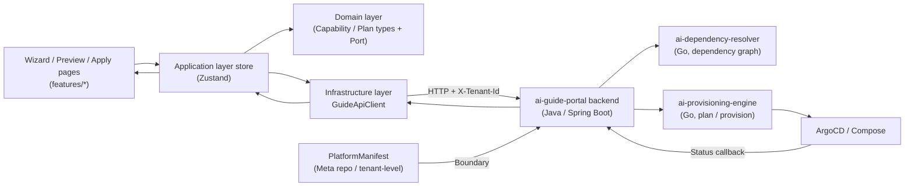

# ai-guide-portal · Skills & Rules (SKILLS)

> Backend API integration rules, state management patterns, and REST contract for the guide portal. Derived from DESIGN.md §3 (State & Data Flow), §5 (Backend API Integration), and A.7 (REST API Contract).

## Meta

| Item | Value |
| --- | --- |
| **repo** | `ai-guide-portal` |
| **scope** | Frontend (TypeScript · React 18) → Backend (Java · Spring Boot 3.x) integration rules |
| **doc status** | draft |

---

## Rule 1: State Management — Assembly Context

### 1.1 Layered State Architecture (§15.6.3)

Follow DDD-inspired four-layer structure for frontend state:

| Layer | Directory | Pattern | Example |
| --- | --- | --- | --- |
| `features/` | Wizard, Plan, Apply, Status pages | Page-level orchestration | `WizardPage.tsx` consuming AssemblyContext |
| `application/` | Zustand stores | State + actions | `assembly/AssemblyContext.tsx` |
| `domain/` | Types + Port interfaces | Pure types, no dependencies | `CapabilityId`, `DependencyNode`, `GuidePort` |
| `infrastructure/` | API client + Keycloak adapter | Concrete implementations | `GuideApiClient`, `KeycloakAdapter` |

### 1.2 AssemblyState Type Definition

```typescript
// application/assembly/AssemblyContext.tsx — Assembly wizard state
interface AssemblyState {
  profile: 'starter' | 'standard' | 'advanced' | 'full';   // from profiles/*.yaml
  selections: CapabilityId[];                                // User-selected capabilities (business language)
  dependencyGraph: DependencyNode[];                         // Expanded transitive dependency graph (§13.3)
  plan: DeploymentPlan;                                      // New/reused/deprecated component list
  applyStatus: 'idle' | 'validating' | 'applying' | 'ready' | 'failed';
  currentManifest: PlatformManifest;                         // Current tenant Manifest snapshot (§12.1)
  tenant: { id: string; manifest: PlatformManifest };        // Scope (§8)
}
```

### 1.3 Rules for State Transitions

| Rule ID | Rule | Trigger | Next State |
| --- | --- | --- | --- |
| S-01 | `applyStatus` must transition `idle → validating → applying → ready` | User clicks "Apply" | sequential |
| S-02 | `applyStatus` transitions to `failed` on any error in chain | API error / provision failure | `failed` |
| S-03 | `selections` update triggers `dependencyGraph` recomputation | User checks/unchecks card | API call to backend |
| S-04 | `dependencyGraph` must be resolved before `plan` is generated | Graph returned from backend | Plan generation enabled |
| S-05 | `currentManifest` is read-only reference; mutations go through backend | Any state change | Backend POST/PUT |
| S-06 | Tenant context (`tenant.id`) must be set before any API call | Component mount | all API calls include X-Tenant-Id |

### 1.4 Zustand Store — Key Actions

- `selectCapabilities(ids)` — set selections, triggers dependency recomputation.
- `previewPlan()` — calls `guideApiClient.preview(tenantId, selections)`, populates `dependencyGraph` and `plan`.
- `applyPlan()` — transitions `idle → validating → applying → ready|failed`, calls `guideApiClient.apply()`.
- `resetWizard()` — clears selections, graph, plan; resets to `idle`.

---

## Rule 2: Data Flow — Frontend ↔ Backend

### 2.1 Data Flow Diagram



### 2.2 Dependency Inversion Rule

The frontend domain layer only depends on `GuidePort` (interface); `infrastructure/GuideApiClient` implements it. The backend internally follows the same pattern (§15.6.2 port-adapter).

```typescript
// domain/port/GuidePort.ts — Frontend domain port
interface GuidePort {
  getCapabilities(tenantId: string): Promise<CapabilityCard[]>;
  preview(tenantId: string, selections: CapabilityId[], profile: string): Promise<PreviewResponse>;
  apply(tenantId: string, planId: string): Promise<ApplyResult>;
  getStatus(tenantId: string): Promise<ComponentStatus[]>;
  rollback(tenantId: string, target: RollbackTarget): Promise<void>;
}
```

---

## Rule 3: Backend API Integration

### 3.1 API Client Configuration

- Base URL from `VITE_GUIDE_API_BASE` env (default `/api/v1`).
- Every request injects `X-Tenant-Id` + `Authorization: Bearer <token>` headers.
- Non-2xx responses are thrown as typed errors; caller handles per the error rules table.

### 3.2 Error Handling Rules

| HTTP Status | Trigger | Frontend Handling Rule |
| --- | --- | --- |
| `401` | Token expired | **Silent refresh → retry**; on failure redirect to login. Never show raw 401 to user. |
| `403` | Cross-tenant access / component outside whitelist | **Result page** + message "This capability is not within your tenant's available scope". |
| `409` | Dependency validation failure (e.g. `rag` but `modelProvider` not enabled) | **Preview page highlights** missing dependencies + "Fill all missing" button (§12.4). |
| `422` | Invalid Manifest delta | **Field-level error display** on the affected form field / preview row. |
| `429` | Assembly API rate limited | **Exponential backoff retry** (max 3 attempts, 1s/2s/4s delays). Show "Rate limited, retrying..." |
| `5xx` | Backend / provisioning engine failure | **ErrorBoundary catch** → error report (Sentry) → "Something went wrong, please retry" with retry button. |

### 3.3 Assembly Engine Integration Boundary

| Rule | Description |
| --- | --- |
| **No direct engine calls** | Frontend must NEVER call `ai-dependency-resolver` or `ai-provisioning-engine` directly. All requests go through the Java backend (anti-corruption layer, §15.6.2). |
| **Upgrade pre-check** | Backend runs dependency validation + resource quota check before `apply`. Frontend should handle `409` by displaying missing dependencies. |
| **Trace propagation** | All API calls include `trace-id` header propagated through the full chain: frontend → Java backend → Go engines → ArgoCD. |

---

## Rule 4: REST API Contract (Backend Endpoints)

### 4.1 Endpoint Table

| Method | Path | Purpose | Request / Response |
| --- | --- | --- | --- |
| `GET` | `/api/v1/capabilities` | **Capability catalog** (business language cards, §13.2) | `200 CapabilityCard[]` (includes `dependsOn`, `enabledByDefault`) |
| `POST` | `/api/v1/plans/preview` | **Dependency expansion + change preview** (§13.3) | body `{selections, profile}` → `{graph, add, reuse, drop, downtime: "none"}` |
| `POST` | `/api/v1/plans/{id}/apply` | **Execute upgrade** (write Manifest + trigger orchestration, §13.3/§13.5) | Runs pre-check (dependency+quota) first; failure `409`; success `202 + ApplyResult` |
| `GET` | `/api/v1/deployments/status` | **Status dashboard** (§13.1) | `ComponentStatus[]` (pending/ready/failed + health) |
| `POST` | `/api/v1/rollbacks` | **Declarative rollback** (§13.5) | body `{target: {capability, enabled: false}}` → rewrites Manifest and replays |

### 4.2 Controller Definition (Java)

```java
// interface_/GuidePortalController.java — Inbound adapter (§15.6.2 ①)
@RestController
@RequestMapping("/api/v1")
public class GuidePortalController {
    private final AssemblyAppService appService;   // ② Application layer use case orchestration

    @PostMapping("/plans/preview")
    public PreviewResponse preview(
            @RequestBody PreviewRequest req,
            @RequestHeader("X-Tenant-Id") String tenantId) {
        return appService.preview(tenantId, req.selections(), req.profile());
    }

    @PostMapping("/plans/{id}/apply")
    public ResponseEntity<ApplyResult> apply(
            @PathVariable String id,
            @RequestHeader("X-Tenant-Id") String tenantId) {
        var result = appService.apply(tenantId, id);
        // Internal: pre-check + write Manifest + call ProvisioningPort
        return ResponseEntity.accepted().body(result);
    }

    @GetMapping("/deployments/status")
    public List<ComponentStatus> status(
            @RequestHeader("X-Tenant-Id") String tenantId) {
        return appService.getComponentStatuses(tenantId);
    }

    @GetMapping("/capabilities")
    public List<CapabilityCard> capabilities(
            @RequestHeader("X-Tenant-Id") String tenantId) {
        return appService.getCapabilities(tenantId);
    }
}
```

### 4.3 Request / Response DTOs

```typescript
// domain/model/PreviewRequest.ts
interface PreviewRequest {
  selections: CapabilityId[];
  profile: 'starter' | 'standard' | 'advanced' | 'full';
}

// domain/model/PreviewResponse.ts
interface PreviewResponse {
  graph: DependencyNode[];
  add: ComponentDelta[];      // New components to deploy
  reuse: ComponentDelta[];    // Existing components unaffected
  drop: ComponentDelta[];     // Components to remove (for rollback)
  downtime: 'none' | 'partial' | 'full';
  resourceImpact: ResourceEstimate;  // CPU / Token / QPS delta
}

// domain/model/ComponentStatus.ts
interface ComponentStatus {
  componentId: string;
  capability: CapabilityId;
  status: 'pending' | 'ready' | 'failed';
  health: 'healthy' | 'degraded' | 'unhealthy';
  lastTransition: string;  // ISO 8601
}
```

### 4.4 API Versioning Rule

- API versions align with `bom.yaml` `interface_versions` (§16.1).
- Breaking changes must bump MAJOR version and be accompanied by an ADR (Architecture Decision Record).
- Frontend should pin its expected API version and validate on startup.

---

## Rule 5: Tenant Context & Auth Headers

### 5.1 Required Headers

| Header | Source | When Required |
| --- | --- | --- |
| `X-Tenant-Id` | Zustand auth store `tenantId` | Every API call |
| `Authorization` | Keycloak token `Bearer <jwt>` | Every API call |
| `X-Trace-Id` | Generated UUID per operation | Every API call (propagated to downstream) |

### 5.2 Tenant Switching Rules

- `platform-admin` role can switch tenants; `tenant-admin` is locked to own tenant.
- When switching tenants, reset assembly state (`selections`, `dependencyGraph`, `plan`) and reload Manifest.
- **Unavailable capabilities**: Cards for components not in the tenant's whitelist must be grayed out with label "Requires platform admin to enable" (§14.5).

---

## Traceability Matrix

| This Document Section | Architecture Document § |
| --- | --- |
| Rule 1 (State Management) | §15.6.3 (TS Packages), §12.1 (Manifest) |
| Rule 2 (Data Flow) | §15.6.2 (DDD), §15.6.3 (TS Packages) |
| Rule 3 (API Integration) | §4.7.3 (Keycloak), §14.1 (Engine Integration), §13.5 (Pre-check) |
| Rule 4 (REST Contract) | §15.6.1 (Java Backend), §15.6.2 (Port-Adapter) |
| Rule 5 (Tenant Context) | §8 (Multi-tenancy), §14.5 (Closed Loop) |

---

## Change Log

| Version | Date | Author | Description |
| --- | --- | --- | --- |
| v0.1-draft | 2026-07-17 | OpenStrata Architecture Team | Initial draft from DESIGN.md §3+§5+A.7 backfill |
